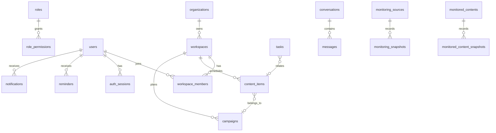

# Database And Data Dictionary

Audience: database administrators and developers  
Last verified version: `0.1.1` / commit `8842877`

## Current Status

The repository contains PostgreSQL schema files, but live backend persistence currently uses a workspace snapshot in Upstash Redis or local file fallback. Do not assume PostgreSQL is the current production source of truth until backend integration is implemented and verified.

## PostgreSQL Files

- `backend/database/postgres/001_unified_schema.sql`: target unified schema.
- `backend/database/postgres/002_backup_catalog.sql`: backup metadata catalog.

## Domain ERD Summary

## Important Tables

Identity/access: `organizations`, `workspaces`, `users`, `roles`, `permissions`, `role_permissions`, `workspace_members`, `member_roles`, `teams`, `team_members`, `auth_sessions`, `invitations`.

Content/calendar: `content_platforms`, `content_types`, `content_statuses`, `content_pillars`, `campaigns`, `content_items`, `tags`, `content_item_tags`, `content_stage_history`, `tasks`, `task_assignments`, `task_dependencies`, `task_status_history`.

Collaboration: `conversations`, `conversation_members`, `messages`.

Notifications: `reminders`, `push_subscriptions`, `notifications`.

Jobs/reports/monitoring: `background_jobs`, `metric_definitions`, `daily_metric_snapshots`, `monitoring_platforms`, `monitoring_sources`, `monitoring_jobs`, `monitoring_snapshots`, `monitoring_metric_values`, `monitored_contents`, `monitored_content_snapshots`, `monitoring_daily_aggregates`, `monitoring_events`, `monitoring_alert_rules`.

Operations: `application_settings`, `audit_logs`, `backup_catalog`.

## Indexes

The schema includes indexes for calendar ranges, task assignee/status/due lookups, conversation membership/message pagination, due reminders, unread notifications, job claiming, monitoring latest snapshots, monitoring events, and audit pagination.

## Time And Dates

SQL timestamps are `timestamptz` UTC. Jalali dates are presentation/input concerns in the frontend.

## Migration Safety

Use reviewed migrations. Do not run destructive schema sync against production. Create or verify a pre-migration backup before production migrations.
