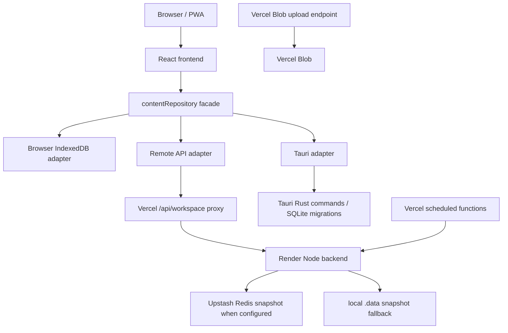

# System Architecture

Audience: developers, operators  
Last verified version: `0.1.1` / commit `8842877`

## Actual Runtime Components

## Planned/Schema Assets Present But Not Runtime-Wired

PostgreSQL schema files are present in `database/postgres`, including a unified domain schema and backup catalog. The current backend code does not yet use PostgreSQL for live workspace operations.

## Frontend

- Entry: `frontend/src/main.tsx`.
- Router: `frontend/src/app/app.tsx`.
- App shell/navigation: `frontend/src/components/app-shell.tsx`.
- Design system primitives: `frontend/src/components/ui.tsx`, `frontend/src/styles/app.css`.
- State/query: TanStack Query, Zustand UI store, repository facade.
- PWA: `frontend/public/manifest.webmanifest`, `frontend/public/sw.js`.
- Persian/Jalali: `@fontsource/vazirmatn`, `shared/utils/jalali.ts`, Jalali date input component.

## Backend

- Entry: `backend/src/server.ts`.
- Main route: `backend/src/routes/workspace.ts`.
- Health endpoints: `/health`, `/health/live`, `/health/ready`, `/health/version`.
- Persistence: Upstash Redis key `taghvim:workspace:v1` when env is configured; otherwise `.data/workspace-snapshot.json`.

## Shared Layer

`shared/` contains domain types, default values, authorization, reports, monitoring, observability, and in-memory workspace repository logic.

## Deployment

- Vercel serves the frontend and `api/` functions.
- Render runs the backend service from `render.yaml`.
- `vercel.json` rewrites `/api/*` paths to functions and all other routes to the frontend.
